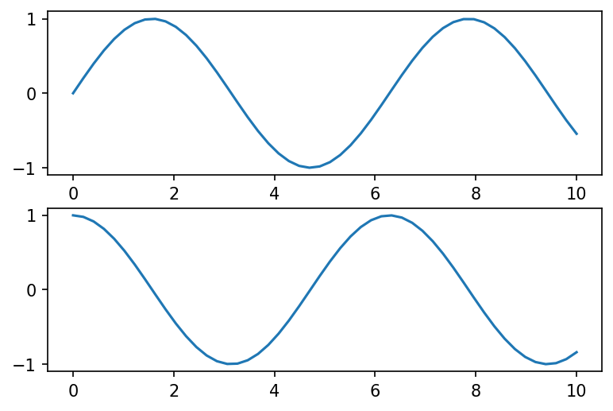
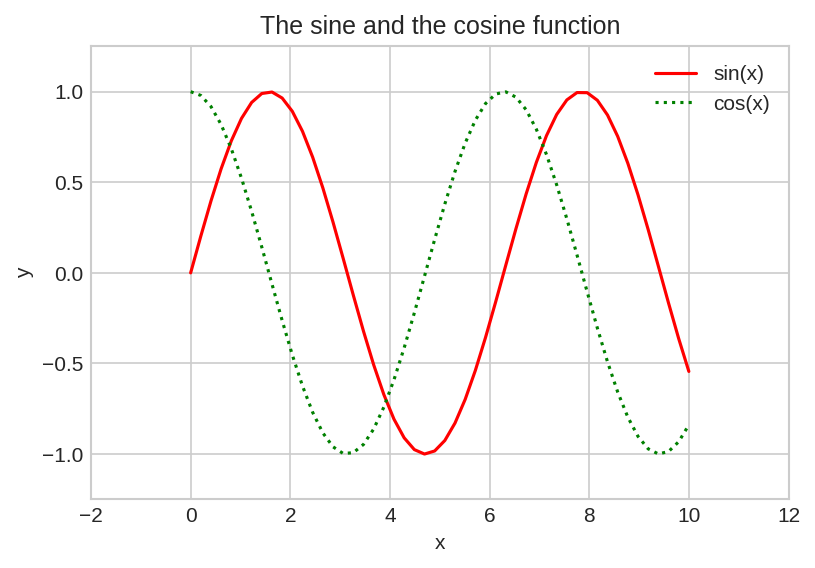
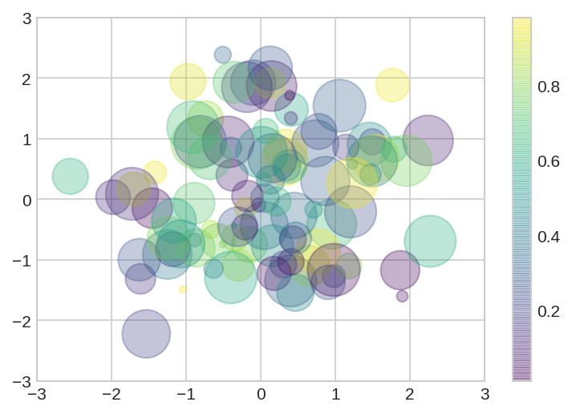
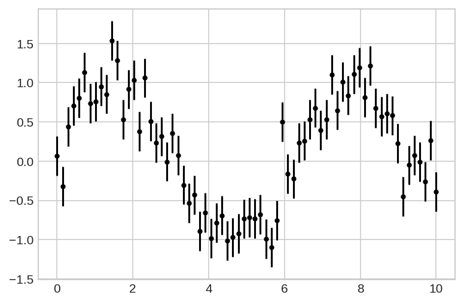

### Stuff this article aims to cover

* What is **matplotlib**?
* How to make simple **line** plots?
* How to make simple **scatter** plots?
* Error bars
* Contour plots
* Histograms, Binning and Density
* How to use **seaborn** to make better looking plots?


# What is matplotlib?

**Matplotlib** is a multiplatform data visualization library built on **NumPy** arrays, and designed to work with the broader **SciPy** stack. One of Matplotlib’s most important features is its ability to play well with many operating systems and graphics backends. Matplotlib supports dozens of backends and output types, which means you can count on it to work regardless of which operating system you are using or which output format you wish.

Just as we use the **np** shorthand for **NumPy** and the **pd** shorthand for **Pandas**, these are some standard shorthands for Matplotlib imports:

```py
import matplotlib as mpl 
import matplotlib.pyplot as plt
```

A potentially confusing feature of Matplotlib is its dual interfaces:

* the MATLAB-style state-based interface
* the object oriented interface

## MATLAB-style interface

Matplotlib was originally written as a **Python** alternative for **MATLAB** users, and much of its syntax reflects that fact. The MATLAB-style tools are contained in the pyplot (**plt**) interface.

```py
plt.figure(dpi=150) # create a plot figure

x = np.linspace(0, 10)

# create the first of two panels and set current axis
plt.subplot(2, 1, 1) # (rows, columns, panel number)
plt.plot(x, np.sin(x))

# create the second panel and set current axis
plt.subplot(2, 1, 2)
plt.plot(x, np.cos(x))
```



## Object oriented interface

The object-oriented interface is available for more complicated situations, and for when you want more control over your figure. Rather than depending on some notion of an “active” figure or axes, in the object-oriented interface the plotting functions are methods of explicit **Figure** and **Axes** objects.

```py
fig, ax = plt.subplots(2, dpi=150)

# Call plot() method on the appropriate object
ax[0].plot(x, np.sin(x))
ax[1].plot(x, np.cos(x))
```


For more simple plots, the choice of which style to use is largely a matter of preference, but the object-oriented approach can become a necessity as plots become more complicated.

# How to make simple line plots?

Perhaps the simplest of all plots is the visualization of a single function y = f(x).

In the following example we demonstrate how a figure and axes can be created using **plt.figure** and **plt.axes** respectively. Once we have created an axes, we can use the **ax.plot** (or the **plt.plot**) function to plot some data. Since we want to create a single figure with multiple lines, we can simply call the **plt.plot** function multiple times. **plt.plot** function takes additional arguments (that are optional) that can be used to specify the **color**, **label**, **linestyle** and others. If no color is specified, Matplotlib will automatically cycle through a set of default colors for multiple lines. Matplotlib does a decent job of choosing default axes limits for your plot, but sometimes it’s nice to have finer control. The most basic way to adjust axis limits is to use the **plt.xlim()** and **plt.ylim()** methods. We can also set the title and axis label using **plt.title**, **plt.xlabel**, **plt.ylabel**. And finally, when multiple lines are being shown within a single axes, it can be useful to create a plot legend that labels each line type. It is easiest to specify the label of each line using the **label** keyword of the **plot** function and then call **plt.legend**.

```py
# We can use the plt.style directive to choose appropriate
# aesthetic styles for our figures
plt.style.use('seaborn-whitegrid') 

fig = plt.figure(dpi=150)
ax = plt.axes()

plt.plot(x, np.sin(x), color='red', label='sin(x)')
plt.plot(x, np.cos(x), color='green', linestyle='dotted', label='cos(x)')

plt.xlim([-2, 12])
plt.ylim([-1.25, 1.25])

plt.title('The sine and the cosine function')
plt.xlabel('x')
plt.ylabel('y')

plt.legend()
```



# How to make simple scatter plots?

We can both use **plt.plot** and **plt.scatter** to create scatter plots.

The primary difference of **plt.scatter** from **plt.plot** is that it can be used to create scatter plots where the properties of each individual point (size, face color, edge color, etc.) can be individually controlled or mapped to data.

In the following example we create a scatter plot with points of many colors and sizes. In order to better see the results, we will also use the **alpha** argument to adjust the transparency level. The color argument is automatically mapped to a color scale shown by the **colorbar()** command, and the size argument is given in pixels. In this way, the color and size of points are used to convey information in the visualization, in order to illustrate multidimensional data.

```py
rng = np.random.RandomState(0)
x = rng.randn(100)
y = rng.randn(100)
colors = rng.rand(100)
sizes = 1000 * rng.rand(100)

plt.figure(dpi=150)
plt.xlim([-3, 3])
plt.ylim([-3, 3])
plt.scatter(x, y, c=colors, s=sizes, alpha=0.3, cmap='viridis')
plt.colorbar()
```



Aside from the different features available in **plt.plot** and **plt.scatter**, why might you choose to use one over the other? While it doesn’t matter as much for small amounts of data, as datasets get larger than a few thousand points, **plt.plot** can be noticeably more efficient than **plt.scatter**. The reason is that **plt.scatter** has the capability to render a different size and/or color for each point, so the renderer must do the extra work of constructing each point individually. In **plt.plot**, on the other hand, the points are always essentially clones of each other, so the work of determining the appearance of the points is done only once for the entire set of data. For large datasets, the difference between these two can lead to vastly different performance, and for this reason, **plt.plot** should be preferred over **plt.scatter** for large datasets.

# Error bars

For any scientific measurement, accurate accounting for errors is nearly as important, if not more important, than accurate reporting of the number itself.

In visualization of data and results, showing errors effectively can make a plot convey much more complete information.

The following example shows a basic **errorbar** plot. The **fmt** is a format code controlling the appearance of lines and points. It has the same syntax as the shorthand used in **plt.plot**.

```py
number_of_points = 70

x = np.linspace(0, 10, number_of_points) 

dy=0.25
np.random.seed(17)
y = np.sin(x) + dy * np.random.randn(number_of_points)

plt.figure(dpi=150)
plt.errorbar(x, y, yerr=dy, fmt='.k')
```



# Contour plots

